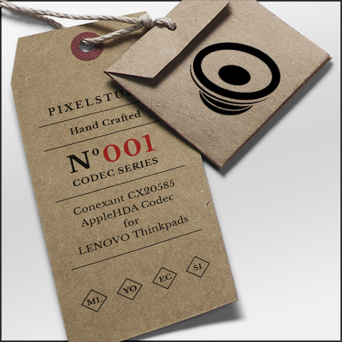
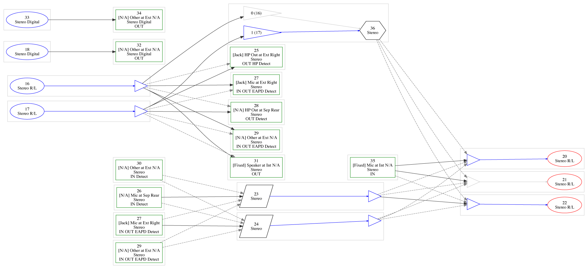
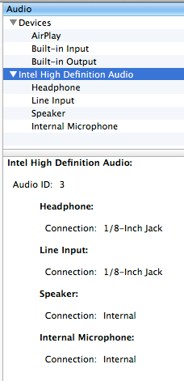
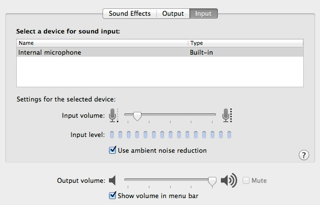
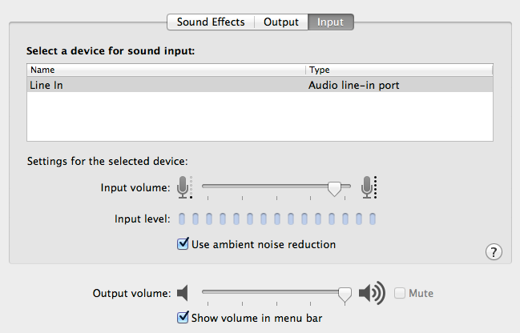

## AppleHDA CX20585 Codec V1.0
 
This is a working Conexant CX20585 AppleHDA-Codec for Lenovo-Laptops like T410/T510 and others. 
V1.0 due to the fact it's not perfect and hdmi support is missing.

First of all: HDA-Codec hacking is a pain!

 

  

## History
After using pre-modified kexts for a long time i decided to make my own *working* one. 

First you've to dump the codecs from linux or windows. 
With the help of different tools you'll get this:

These informations are used to make the audio mapping and the pin-configuration.

  

The result looks like this:

Working features: 
- internal mic 
- internal speakers 
- headphones 
- combo jack sensing (external mic/headphone) 
- ambient noise reduction 
- mic volume for the ext mic 
- mute 

This release works, but is not complete. I.e. the input-volume of the internal microphone is not working, but it's set to a useable value.

Tested with Mountain Lion, Yosemite and El Capitan.
  

## Howto
1. Make sure your system uses the audio layoutID 3. 
This could be happen i.e. via bootloader, custom dsdt or an enabler kext. 

2. The AppleHDA.kext 
For ML i use a patched kext. 
For YO and EC a dummy kext is my first choice. 
AppleHDA binary is patched on the fly via bootloader (Find: 8B19D411 / Replace: 6950F114). 

- Patch to use the right codec-id. 
- Insert pin-configuration. 
- Insert id 3 mapping. 
- Insert mapping data to the platform.xml. 

Don't forget to clean the caches before reboot!
  

Have fun!

